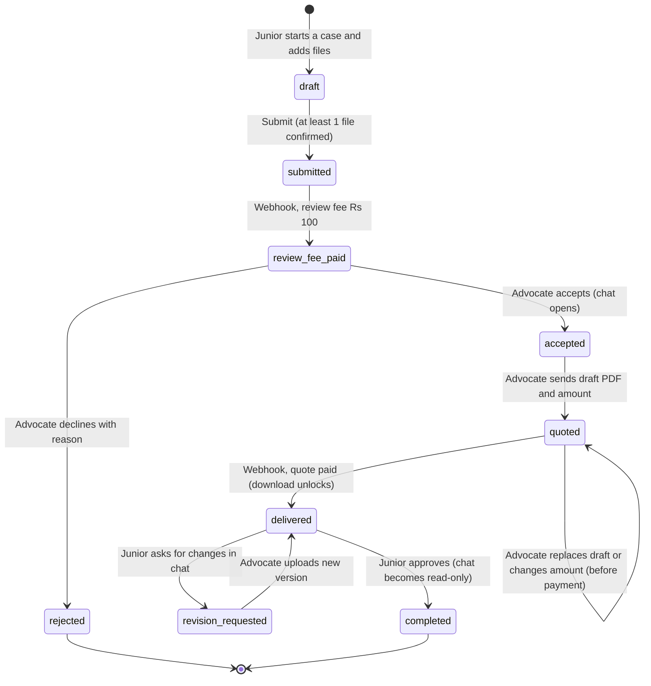

# New Flow Spec: quote after draft, case chat, multi-file upload

Status: proposed. Where this file disagrees with `docs/workflow.md`, this file wins.
Builds on `docs/UX_DISCOVERY.md` (finding IDs like F-05 refer to it).

## 1. What changes

1. **Review fee stays ₹100.** The drafting fee stops being a fixed ₹400. After the draft is finished, the advocate sets an amount for that case (a *quote*). The junior pays that amount to unlock the download.
2. **Case chat.** Once the advocate accepts a case, the case gets a private chat between the advocate and the junior (Instagram-DM style) to discuss details and requests. The advocate then drafts the PDF. The junior can download it only after paying.
3. **Multi-file intake.** The first submission accepts PDF, DOC, DOCX, PNG, JPG, JPEG, and several files at once instead of one PDF.

## 2. Decisions taken (change any of these before building)

| # | Decision | Why |
|---|---|---|
| D1 | "docs" means `.doc` and `.docx`. | Most likely reading. |
| D2 | Before paying, the junior sees a **locked draft card** (file name, page count, size, date) but cannot open the file. | Protects the advocate's work. Trust comes from the accepted case and the chat. Watermarked preview is a later option (Q1). |
| D3 | The fixed ₹150 paid revision is **retired**. Changes are requested in chat. The advocate can replace the draft and change the amount any time before payment. After payment, new versions are free and downloadable at once. | Chat replaces the revision dialog. One payment moment instead of three. |
| D4 | Chat is **open** in `accepted`, `quoted`, `delivered`, `revision_requested`; **read-only** in `completed`; **unavailable** before acceptance and for rejected cases. | Matches "after the advocate accepts". |
| D5 | A refund **revokes** the junior's download access. | Otherwise refund and access contradict each other. |
| D6 | Quote bounds are configurable: `QUOTE_MIN_INR=100`, `QUOTE_MAX_INR=100000`. | Prevents typos like ₹25 or ₹25,00,000. |
| D7 | Upload limits are configurable: 10 files per submission, 25 MB per file, 100 MB per case. | No limits exist today (F-24). |

## 3. Lifecycle

| Status | Whose turn | Junior sees (label) | Advocate sees (label) | Chat | Junior can download draft |
|---|---|---|---|---|---|
| `draft` | Junior | Draft: add files | (hidden) | no | no |
| `submitted` | Junior | Pay ₹100 to send for review | Awaiting payment | no | no |
| `review_fee_paid` | Advocate | In review | Needs your decision | no | no |
| `rejected` | none | Not accepted | Declined | no | no |
| `accepted` | Advocate | Accepted: discuss details | Discuss, then send draft and quote | open | no |
| `quoted` | Junior | Draft ready: pay ₹X to unlock | Waiting for payment | open | **no** (locked) |
| `delivered` | Junior | Ready to download | Delivered | open | yes |
| `revision_requested` | Advocate | Changes requested | Changes requested | open | yes (previous versions) |
| `completed` | none | Completed | Completed | read-only | yes |

Delete from code and UI: `under_review`, `drafting`, `approved`, `drafting_fee_paid`, `draft_delivered` (old names), `DocumentType.FINAL` (never used; the latest paid draft *is* the final).

## 4. Quote rules

- Created only in `accepted` or `quoted`, by a holder of `quote:create` (super_admin), **together with a draft PDF**. No draft, no quote.
- The advocate enters whole rupees. The server stores `amount_paise` and enforces the bounds in D6. Optional note, 500 characters max, shown on the quote card.
- **The server never trusts an amount from the client.** The Razorpay order amount is read from the quote row. The webhook checks that `order_id` and `amount` match the quote before unlocking.
- One open order per quote: repeated "Pay" clicks reuse the pending order (F-10).
- If the advocate changes the draft or the amount while `quoted`: create a new quote version, mark the old one `superseded`, cancel its order, post a chat system message ("Quote updated: ₹X").
- If a capture arrives for a `superseded` quote: do not unlock, refund automatically, post a system message.
- Webhook is idempotent on `gateway_payment_id`, and only moves `quoted` to `delivered`. It must not change any other status.
- After payment the quote is locked (`paid`).
- Refund processed: quote becomes `refunded`, junior download is blocked, the case shows a "Refunded" card. Case status is not rolled back (Q3).

## 5. Download gating (enforced on the server, never only in the UI)

| Document | Advocate (`case:draft` / `case:view_all`) | Junior (owner) |
|---|---|---|
| `original`, `supporting` | always | always |
| `draft` (every version) | always | only when the case's quote is `paid`. Otherwise `403 {"detail": "payment_required"}` |

- `GET /documents/case/{id}` returns every draft row for the junior with `locked: true|false` and **no `storage_key`** while locked.
- Presigned URLs stay 300 s. Never log them.
- Draft files must be PDF, at most 25 MB. Compute `page_count` on the server at confirm time.
- This closes F-05 (no final download), F-22 (old drafts unreachable), F-35 (no status gating).

## 6. Multi-file upload

| Extension | Content-Type |
|---|---|
| `.pdf` | `application/pdf` |
| `.doc` | `application/msword` |
| `.docx` | `application/vnd.openxmlformats-officedocument.wordprocessingml.document` |
| `.png` | `image/png` |
| `.jpg`, `.jpeg` | `image/jpeg` |

Flow (all failures resumable, no duplicate cases, fixes F-15):

1. `POST /cases` `{title, case_type, note?}` creates the case as `draft`. Not visible to the advocate, not payable.
2. `POST /documents/upload-urls` `{case_id, files:[{filename, content_type, size}]}` validates the whitelist and limits, returns one presigned PUT per file. The signed `Content-Type` is exactly the validated one (fixes the mismatch in F-24).
3. Browser uploads up to 3 files in parallel with per-file progress, remove and retry.
4. `POST /documents/confirm-batch` `{case_id, files:[{storage_key, original_filename}]}`. The server checks each object exists, size is within limit, and the first bytes match the claimed type (magic-byte check). Mismatches are rejected and deleted.
5. `POST /cases/{id}/submit` requires at least one confirmed `original`. Status becomes `submitted`. The UI goes straight to paying ₹100.
6. A scheduled job deletes `draft` cases (and their objects) older than 7 days.

After acceptance, extra files go through chat attachments (type `supporting`). Before acceptance, files can be added only while `draft` or `submitted`.

DOC and DOCX cannot be previewed in a browser: download only. PDF and images preview inline.

## 7. Case chat

**Behaviour**
- One thread per case, participants: the owning junior and users with `case:message` (super_admin; clerk optional, off by default).
- Message kinds: `text`, `file` (up to 5 attachments, same file rules), `system` (server-created event lines), `quote` (server-created card), `draft` (server-created card).
- System messages are written by the service layer in the same transaction as the event: accepted, quote sent or updated, payment received, new draft version, changes requested, completed.
- Rendering: plain text only (never HTML). URLs are auto-linked with `rel="noopener noreferrer"`.
- Limits: 4000 characters per message, 30 messages per minute per user.
- `client_id` (UUID from the browser) makes sending idempotent, so retries never duplicate.
- Read state per participant. The UI shows an unread divider, unread badges, and "Seen" under the last own message.

**Data**
- `messages(id, case_id, sender_id null for system, kind, body, meta jsonb, created_at, client_id unique per sender)`, index `(case_id, id)`.
- `message_attachments(message_id, document_id)`.
- `case_reads(case_id, user_id, last_read_message_id, updated_at)`.

**API**
- `GET /cases/{id}/messages?before=<id>&limit=30`
- `POST /cases/{id}/messages` `{body?, document_ids?[], client_id}`
- `POST /cases/{id}/read` `{last_read_message_id}`
- `GET /cases` adds `last_message {preview, at, sender_name}`, `unread_count`, and `turn: "you" | "them" | "none"`.

**Realtime**
- Phase A: polling (3 s while a thread is open, 30 s for the list).
- Phase B: WebSocket `WS /ws`. Auth with a single-use ticket from `POST /ws/ticket` (valid 30 s), so tokens never sit in URLs. Fan out through Redis pub/sub because the API runs 4 workers. Events: `message.created`, `case.status_changed`, `read.updated`. Fall back to polling when the socket drops; reconnect with backoff.
- nginx needs a `/api/ws` location with `proxy_http_version 1.1`, `Upgrade` and `Connection` headers, and a long `proxy_read_timeout`.

**Notifications**
- New message: in-app notification for the other party, collapsed to one per unread run.
- Email if still unread after 10 minutes (debounced). The right channel (email, WhatsApp, SMS) is Q6.
- The advocate finally gets notifications: new paid case, quote paid, changes requested, new message (fixes F-03).

## 8. Data model changes

| Table | Change |
|---|---|
| `cases` | new statuses per section 3; add `note text`; keep `revision_count` for information only |
| `quotes` (new) | `id, case_id, version, amount_paise, currency, note, draft_document_id, status (open, paid, superseded, refunded), created_by, created_at, paid_at` |
| `payments` | add `quote_id` nullable; new rows use `type` = `review` or `quote`; legacy enum values stay for old rows |
| `case_documents` | type adds `supporting`; add `size_bytes`, `content_type`, `page_count` |
| `messages`, `message_attachments`, `case_reads` (new) | section 7 |
| `roles.permissions` | add `case:message`, `quote:create`; update `scripts/seed_roles.py` |
| `GET /users/me` | returns `permissions[]` so the UI stops checking role names (F-23) |

Postgres native ENUMs: `ALTER TYPE ... ADD VALUE` cannot run inside a transaction block, so use Alembic's autocommit block for those statements.

## 9. API changes

| Change | Endpoint |
|---|---|
| Add | `POST /cases/{id}/submit`, `POST /documents/upload-urls`, `POST /documents/confirm-batch` |
| Add | `POST /cases/{id}/quote` `{draft:{storage_key, original_filename}, amount_inr, note?}`: confirms the draft, creates the quote, sets `quoted`, posts the chat cards, all atomically |
| Add | `POST /cases/{id}/drafts` `{storage_key, original_filename}`: new version while `revision_requested`, sets `delivered`, no payment |
| Add | `GET /cases/{id}/quote`, `POST /cases/{id}/quote/pay` (creates or reuses the order for the open quote), `POST /payments/{id}/reconcile` (asks Razorpay for the real status when the webhook is late, F-12) |
| Add | messages, read, ws endpoints (section 7) |
| Change | `GET /documents/case/{id}` and `GET /documents/{id}/download-url` (gating, section 5) |
| Change | `GET /cases` adds submitter name and Bar Council ID for the advocate, plus `unread_count`, `last_message`, `turn` |
| Change | `POST /cases/{id}/revision` becomes free "request changes": reason required, posts a system message, sets `revision_requested` |
| Remove | `POST /cases/{id}/drafting-payment`, the paid path of `/revision`, `DRAFTING_FEE_INR`, `REVISION_FEE_INR`, `FREE_REVISIONS`, non-original types in `POST /documents/confirm` |

## 10. Migrating existing data

Check first whether production data exists. `docs/payments-setup.md` suggests the app is not live yet. If there is no data, write a clean migration and skip the rest.

| Old status | New |
|---|---|
| `submitted`, `review_fee_paid`, `accepted`, `revision_requested`, `completed`, `rejected` | unchanged |
| `drafting_fee_paid` | `accepted`, plus a `paid` quote linked to the ₹400 payment, flagged so the next draft upload goes straight to `delivered` |
| `draft_delivered` | `delivered`, plus a `paid` quote linked to the ₹400 payment |
| `under_review`, `drafting`, `approved` | none exist, delete the enum values |

## 11. Edge cases

- **Payment done, webhook late:** show "Confirming your payment", and after 60 s "Taking longer than usual. Your payment is safe." Offer "Check status" (reconcile endpoint). Never leave the spinner running silently (F-12).
- **Advocate mis-quotes:** can correct before payment. After payment, use refund.
- **Junior abandons after quote:** the draft stays locked. Optional reminder after N days (later).
- **Checkout open while the quote changes:** the order is bound to a quote version. A capture on the old order is auto-refunded (section 4).
- **Confidentiality:** chat and files are visible only to case participants. No public links.

## 12. Open questions for the owner

- **Q1** Should the junior get a watermarked first-page preview before paying?
- **Q2** If the scope grows after delivery, may the advocate send an extra quote (same quote mechanism, new version)?
- **Q3** On refund, should the case roll back, close, or stay as is?
- **Q4** May the advocate ask a clarifying question in chat *before* deciding? (Requested behaviour is "after accept", so this is not built.)
- **Q5** Per-case pricing and pay-to-unlock may interact with Bar Council fee rules. `docs/backlog.md` already lists this as P0. Get it checked before launch.
- **Q6** Which alert channel do users actually read: email, WhatsApp, SMS?
- **Q7** Will a clerk ever draft or chat on the advocate's behalf?
