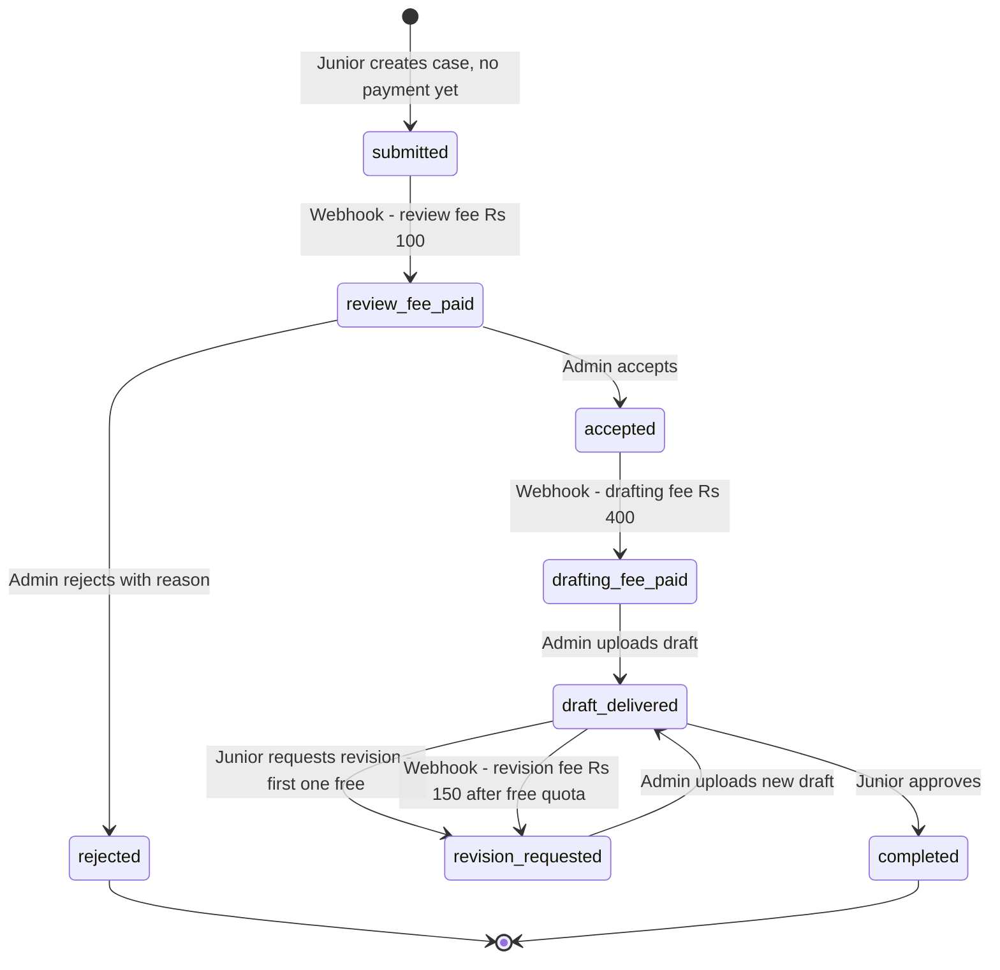
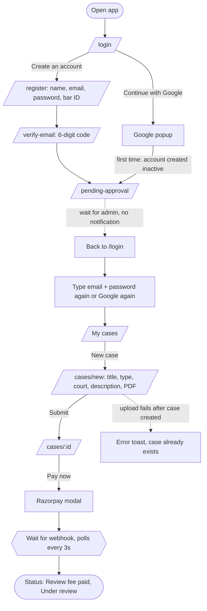
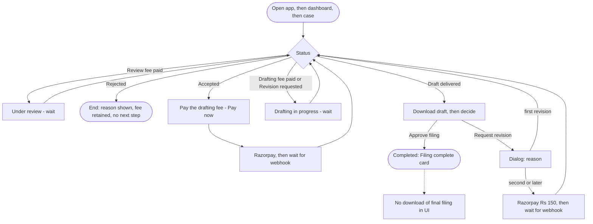
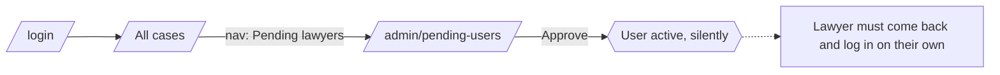
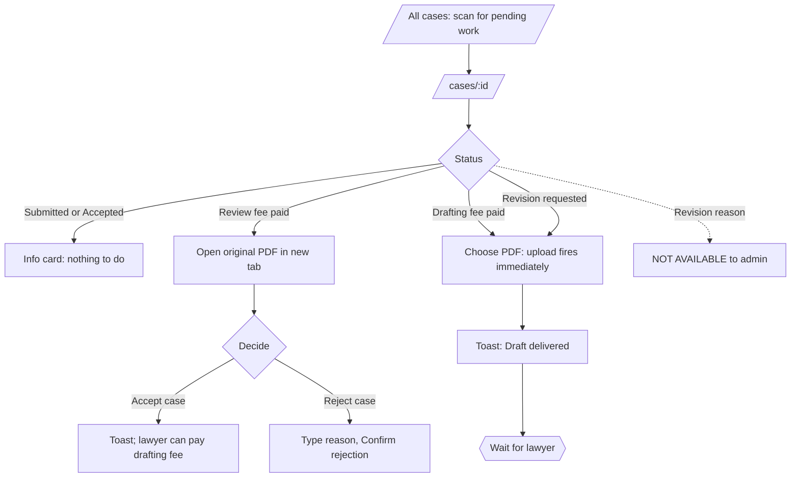

# UX Discovery — Legal Case-Filing Platform

Purpose: give a UX designer everything needed to redesign the product around "radically simple" — fewer steps, one obvious action per screen, no manual.

**Method and scope.** Read-only pass over `app/`, `frontend/web/`, `frontend/bff/`, `docs/`, `CLAUDE.md`, `docker-compose.yml`, `.env.example`, `.github/workflows/ci.yml`, `tests/`. Nothing was run or measured in a browser; contrast ratios below were computed from the CSS token values, and bundle size / real load time are **NOT MEASURED**.

**Working-tree caveat.** `git status` shows uncommitted changes to the frontend (new `verify-email-page.tsx`, `pending-approval-page.tsx`, `features/errors/*`, `status-page.tsx`, `error-boundary.tsx`, edits to `App.tsx`, `login-page.tsx`, `register-page.tsx`, `otp-step.tsx`, `case-detail-page.tsx`). This document describes the **working tree**, not the last commit.

**Source-of-truth caveat.** `docs/*.md` is partly stale. `docs/backlog.md` says refunds and CI are not built; both exist (`app/routers/payments.py:40-53`, `.github/workflows/ci.yml`). `docs/workflow.md` lists four notification events; code emits more (§9). Where docs and code disagree, this file follows the code.

Conventions: "NOT FOUND" = searched for and absent. Severity = High / Medium / Low. Fee amounts are defaults from `app/config.py:45-48`, overridable by env.

---

## 1. Product summary

**Users.** (a) *Junior lawyers* who hold a case and want a senior advocate to help file it. (b) One *senior advocate* (role `super_admin`, called "admin" in code and "the advocate" in UI copy) who reviews, drafts and delivers. Two further roles, `clerk` and `accountant`, are seeded with read permissions but have no purpose-built screens (`docs/backlog.md` P2; `CLAUDE.md` "Known gaps").

**Problem.** Junior lawyers need a filing-ready draft from a senior; the advocate needs a paid, structured intake instead of ad-hoc PDFs and chats.

**Core value.** Upload a case PDF, pay a small review fee, get an accept/reject decision, pay a drafting fee, receive a drafted filing back, optionally ask for revisions, approve. Payments are gated per stage and confirmed by Razorpay webhook (`CLAUDE.md` Conventions).

**Money at a glance.** ₹100 review + ₹400 drafting = ₹500 for a straight-through case; first revision free, each later revision ₹150 (`app/config.py:45-48`). Review fee is retained on rejection (`docs/workflow.md` step 1).

---

## 2. Tech stack

### Frontend (`frontend/web`)

| Concern | Choice | Evidence |
|---|---|---|
| Framework | React 19 + TypeScript, Vite 8 SPA | `frontend/web/package.json` |
| UI library | Local component kit on Radix primitives (Dialog, Dropdown, Tabs, Toast) + `lucide-react` icons | `src/components/ui/*`, `package.json` |
| Styling | Tailwind CSS v4 (`@tailwindcss/vite`), CSS custom properties in `@theme`/`:root`, `class-variance-authority` for button variants, `tailwind-merge` | `src/index.css`, `src/components/ui/button-variants.ts`, `src/lib/utils.ts` |
| Animation | `framer-motion` — page fade/slide on route change only | `src/components/layout/app-shell.tsx:76-85` |
| Routing | `react-router-dom` v7, `BrowserRouter`, nested `RequireAuth` layout routes | `src/App.tsx` |
| Server state | TanStack Query v5 (`retry: 1`, `staleTime: 15s`, no refetch on focus) | `src/lib/query-client.ts` |
| Client state | React context for auth; module-level in-memory access-token store; component `useState` | `src/auth/*`, `src/lib/token-store.ts` |
| Forms / validation | `react-hook-form` + `zod` via `@hookform/resolvers` (login, register, new case); plain `useState` for OTP, rejection reason, revision reason | `src/features/**` |
| API client | `axios` — `apiClient` (`/api`, bearer token, one 401→refresh→retry) and `bffClient` (`/bff`, cookies) | `src/lib/api-client.ts`, `src/lib/bff-client.ts` |
| Auth | Email+password or Google Identity Services → JWT access token (30 min) held **in memory only**; refresh token (7 d) in an httpOnly cookie owned by the BFF | `src/auth/auth-provider.tsx`, `frontend/bff/src/cookies.ts`, `app/config.py:13-14` |
| Payments | Razorpay hosted Checkout (`checkout.razorpay.com/v1/checkout.js`, loaded on first click) | `src/hooks/use-razorpay.ts` |
| File upload | Browser → presigned S3 `PUT` directly; API never sees bytes | `src/lib/api/documents.ts:19-25`, `app/services/storage_service.py` |
| Testing | Vitest + Testing Library; only 4 frontend test files (api-client, token-store, status-pill, error-boundary) + 1 BFF test file | `src/**/*.test.*`, `frontend/bff/src/routes/auth.test.ts` |
| Lint / format | oxlint, prettier (+ tailwind plugin) | `package.json`, `.oxlintrc.json` |
| Deployment | `docker compose`: `api` (gunicorn, 4 uvicorn workers), `db` (Postgres 16), `redis`, `storage` (SeaweedFS S3) + `storage-init`, `bff` (Node 22), `web` (nginx serving SPA, reverse-proxying `/api/*`→api and `/bff/*`→bff, same-origin). Plain HTTP only; TLS is left to the host (`docs/payments-setup.md` §5). CI: GitHub Actions for backend tests, web typecheck/lint/test/build, bff typecheck/test/build | `docker-compose.yml`, `frontend/web/nginx.conf`, `Dockerfile`, `.github/workflows/ci.yml` |

### BFF (`frontend/bff`)
Express 5 + helmet + `express-rate-limit` (20 req/min/IP for **all** BFF routes). Only `/login`, `/login/google`, `/refresh`, `/logout`, `/health`. Exists solely so the refresh token never reaches browser JS (`frontend/bff/src/server.ts`, `src/routes/auth.ts`).

### Backend (`app/`)
- **FastAPI** (async) with routers `auth, users, cases, documents, payments, notifications, webhooks` (`app/main.py:71-77`); thin routers call `app/services/*`; routers commit, services flush (`CLAUDE.md`).
- **DB:** PostgreSQL via SQLAlchemy 2.0 async/asyncpg; Alembic migrations 0001–0003; native ENUM and ARRAY types.
- **Auth:** HS256 JWT access/refresh with a `type` claim; bcrypt passwords; email OTP (6 digits, 10 min, 5 attempts) via SMTP; Google ID-token verification (`app/core/security.py`, `app/services/otp_service.py`, `app/core/google_auth.py`).
- **RBAC:** permission strings in `roles.permissions` (ARRAY); `require_permission()` per route + `authorize_case_access()` for row ownership (`app/dependencies.py`, `app/services/case_service.py:55-59`).
- **Storage:** S3-compatible (SeaweedFS locally, AWS S3 supported), presigned URLs valid 300 s (`app/config.py:26`).
- **Other:** Razorpay orders + HMAC-verified webhook; Redis-backed slowapi rate limits (100/min default; 10/min on payment-order routes; 10/h verify-email; 5/h resend-otp); structlog with request IDs; append-only `audit_logs` written in the same transaction as each action.

---

## 3. Roles and permissions

### 3.1 Permission matrix (`app/core/permissions.py:10-44`)

| Permission | super_admin | junior_lawyer | clerk | accountant | Enforced by a route? |
|---|:-:|:-:|:-:|:-:|---|
| `case:submit` | | ✔ | | | Yes — `POST /cases` |
| `case:view_own` | | ✔ | | | **No** — never checked; `GET /cases` filters by *absence* of `case:view_all` (`app/routers/cases.py:45`) |
| `case:view_all` | ✔ | | ✔ | | Yes — list + `authorize_case_access` bypass |
| `case:review` | ✔ | | | | **No** — defined, unused |
| `case:decide` | ✔ | | | | Yes — `PATCH /cases/{id}/decision` |
| `case:draft` | ✔ | | | | Yes — draft upload in `documents.py:32`, and confirm → `deliver_draft` |
| `case:request_revision` | | ✔ | | | Yes |
| `case:approve_final` | | ✔ | | | Yes |
| `payment:initiate` | | ✔ | | | Yes — 3 order-creating routes |
| `payment:view_own` | | ✔ | | | **No** — never checked |
| `payment:view_all` | ✔ | | | ✔ | Yes — `GET /payments` |
| `payment:refund` | ✔ | | | | Yes — `POST /payments/{id}/refund` |
| `user:manage` | ✔ | | | | Yes — `/users/pending`, `/users/{id}/approve` |
| `audit:view` | ✔ | | | | **No** — no audit read endpoint exists (NOT FOUND) |

### 3.2 What each actor can see and do — API vs. actual UI

| Actor | API allows | UI actually offers |
|---|---|---|
| **Visitor (no account)** | Register, verify OTP, resend OTP, login, Google login | `/login`, `/register`, `/verify-email` (needs router state), `/pending-approval` |
| **Registered, not yet approved** | Nothing beyond the visitor set: login returns 403 "Account pending admin approval" / "Please verify your email first" (`app/routers/auth.py:38-42`) | Redirected to `/verify-email` or `/pending-approval` (`login-page.tsx:41-53`) |
| **junior_lawyer** | Create case; view/pay/upload/download **own** cases; request revision; approve; own notifications; `GET /users/me` | Dashboard "My cases" with status filters; `/cases/new`; case detail with the stage-appropriate action; profile (read-only); notification bell |
| **super_admin** | View **all** cases/docs/payments; accept/reject; upload drafts; list & approve pending users; list all payments; refund | Dashboard "All cases"; case detail with decision panel / draft upload; `/admin/pending-users`; `/admin/payments` (with Refund) |
| **clerk** | View all cases, their documents and per-case payments (via `case:view_all`) | **No role-specific UI.** Reuses the dashboard, which labels the list "My cases" and shows a "New case" button leading to a 403 page; on a case, shows the *junior's* "Pay now" card that the API will reject (UI keys on `role_name === 'super_admin'`, not permissions: `case-detail-page.tsx:30`, `dashboard-page.tsx:37`, `app-shell.tsx:21`) |
| **accountant** | `GET /payments` only | **None.** `/admin/payments` is wrapped in `RequireAuth roles={['super_admin']}` (`App.tsx:42-45`); nav link hidden; dashboard shows an empty "My cases" |

**How guarding works.**
- Backend: `Depends(require_permission(X))` reads the permission list from the user's role row on each request, so revocations apply immediately (`app/dependencies.py:46-61`). Per-case ownership is a separate explicit call (`authorize_case_access`) in each router handler.
- Frontend: `RequireAuth` (`src/auth/require-auth.tsx`) redirects unauthenticated users to `/login` and shows an inline 403 when `roles` doesn't include `user.role_name`. The frontend never receives a permission list, only `role_name` (`UserOut`, `app/schemas/user.py`), so UI gating is role-name based.
- Account bootstrap: only `junior_lawyer` accounts can be self-registered (`app/routers/auth.py:57`, `:170`). **NOT FOUND:** any script, endpoint or doc for creating the first `super_admin`, `clerk` or `accountant` user (`scripts/seed_roles.py` seeds roles only).

---

## 4. Domain model and case lifecycle

### 4.1 Entities (`app/models/*`)

| Entity | Fields (beyond `id`, `created_at`, `updated_at`) | Notes |
|---|---|---|
| **User** | `full_name`, `email` (unique), `phone?`, `hashed_password?`, `google_sub?`, `bar_council_id?`, `role_id`, `is_active`, `is_verified` | New users start `is_active=false`; `is_verified` set by OTP, Google, or admin approval |
| **Role** | `name` (unique), `permissions[]` | Editable per deployment |
| **Case** | `junior_lawyer_id`, `title`, `case_type`, `court?`, `description?`, `status`, `rejection_reason?`, `revision_count` | No submitter *name*, no case number, no deadline/hearing date, no assignee |
| **CaseDocument** | `case_id`, `type` (`original`/`draft`/`final`), `version`, `storage_key`, `original_filename`, `uploaded_by` | `final` is never created (see §13). Multiple `original` docs are technically possible but the UI only supports one |
| **Payment** | `case_id`, `type` (`review`/`drafting`/`revision`), `amount`, `currency`, `status` (`pending`/`paid`/`failed`/`refunded`), `gateway_order_id`, `gateway_payment_id`, `gateway_signature`, `paid_at?`, `refunded_at?` | |
| **RevisionRequest** | `case_id`, `requested_by`, `reason`, `status` (`pending`/`resolved`) | Written; **never readable** through any endpoint or UI |
| **Notification** | `user_id`, `message` (≤500), `is_read` | No link/case reference |
| **AuditLog** | `user_id?`, `action`, `entity_type`, `entity_id`, `log_metadata` | Write-only; no read endpoint |
| **EmailOtp** | `user_id`, `code_hash`, `expires_at`, `attempts` | |

### 4.2 Case statuses and transitions

Enum has 11 values (`app/models/case.py:12-23`). **Three are never assigned by any code path:** `under_review`, `drafting`, `approved`. The UI still has labels and switch branches for them (`status-pill.tsx:4-30`, `case-detail-page.tsx:206,244,267`, `dashboard-page.tsx:21-31`).

| From | Trigger | Who / how | To | Money | Guard |
|---|---|---|---|---|---|
| — | `POST /cases` | junior | `submitted` | none | `case:submit` |
| `submitted` | Razorpay `payment.captured` (review) | System via webhook, after junior clicks Pay now | `review_fee_paid` | **₹100** | order only creatable in `submitted` (`payment_service.py:24-28`) |
| `review_fee_paid` | `PATCH /cases/{id}/decision {accept:false, rejection_reason}` | admin | `rejected` (terminal) | fee retained; refund only by manual admin action | `_assert_status("decide")` |
| `review_fee_paid` | same, `accept:true` | admin | `accepted` | — | same |
| `accepted` | `payment.captured` (drafting) | system | `drafting_fee_paid` | **₹400** | order only creatable in `accepted` |
| `drafting_fee_paid` | `POST /documents/confirm` type≠original | admin | `draft_delivered` (v1) | — | `case:draft` |
| `draft_delivered` | `POST /cases/{id}/revision`, `revision_count < 1` | junior | `revision_requested`, `revision_count+1` | free | `case:request_revision` |
| `draft_delivered` | same, `revision_count ≥ 1` | junior → API returns Razorpay order → `payment.captured` (revision) | `revision_requested`, `revision_count+1` | **₹150** each | order only creatable in `draft_delivered` |
| `revision_requested` | `POST /documents/confirm` type≠original | admin | `draft_delivered` (v = `revision_count+1`) | — | same as above |
| `draft_delivered` | `POST /cases/{id}/approve` | junior | `completed` (terminal) | — | `case:approve_final` |

`POST /documents/confirm` treats **any** non-`original` type (including `final`) as a draft delivery (`app/routers/documents.py:56-72`).

### 4.3 Money rules as coded

| Payment | Amount (default) | Payable only when case is | Unlocks | Refund |
|---|---|---|---|---|
| Review | ₹100 (`REVIEW_FEE_INR`) | `submitted` | `review_fee_paid` | Admin button on `/admin/payments` → Razorpay refund → `refund.processed` webhook sets `refunded`. **Does not change case status** (`payment_service.py:163-181`) |
| Drafting | ₹400 (`DRAFTING_FEE_INR`) | `accepted` | `drafting_fee_paid` | same |
| Revision | ₹150 (`REVISION_FEE_INR`) after `FREE_REVISIONS=1` | `draft_delivered` | `revision_requested` | same |

Failed payments: `payment.failed` marks the payment `failed`, leaves the case unchanged, and creates an in-app notification (`payment_service.py:91-119`). Nothing else changes; the user retries via **Pay now**, which creates a **new** order.

---

## 5. User journeys as implemented

API calls below are paths on the FastAPI backend (SPA calls them as `/api/...`); BFF calls are `/bff/...`.

### 5.1 Journey J1 — Junior lawyer: first visit → first case submitted and review fee paid

| # | Screen / route | User action | Fields | API calls | Success / error feedback |
|---|---|---|---|---|---|
| 0 | `/` → redirect `/login` | Opens app; SPA silently tries to restore session | — | `POST /bff/refresh` (401 for new visitors) | Full-screen spinner while checking (`require-auth.tsx:11`) |
| 1 | `/login` | Clicks "Create an account" (or "Continue with Google", see J1-G) | — | — | — |
| 2 | `/register` | Fills form, clicks "Create account" | Full name*, Email*, Password* (≥8), Bar council ID (opt.) | `POST /auth/register` → sends OTP email (failure to send is swallowed, `auth.py:75-78`) | Inline red text on error (422 detail or generic). Success: silent navigation to step 3, no toast |
| 3 | `/verify-email` | Reads email, types code, clicks "Verify" | 6-digit code* | `POST /auth/verify-email`; optional `POST /auth/resend-otp` (60 s cooldown) | Inline error text ("Incorrect code", "expired", "Too many incorrect attempts"). Success: navigate |
| 4 | `/pending-approval` | Reads message; clicks "Back to sign in" | — | — | Static message: "An admin needs to approve your account… you'll be notified as soon as that happens" |
| — | *(out-of-band wait for admin — unbounded)* | | | | See J3; **no notification is actually sent** |
| 5 | `/login` | Re-types email + password, clicks "Sign in" | Email*, Password* | `POST /bff/login` → backend `/auth/login` + `/users/me` | Inline error; 403 unverified/pending redirects to steps 3/4 |
| 6 | `/` (My cases) | Clicks "New case" (header button or page button) | — | `GET /cases`, `GET /notifications/me` | Skeleton → list or empty state "No cases yet / Submit your first case" |
| 7 | `/cases/new` | Fills form, chooses PDF, clicks "Submit case" | Case title* (3–255), Case type* (2–100, free text), Court, Description, Original PDF (labelled optional) | `POST /cases` → `POST /documents/upload-url` → `PUT` to S3 → `POST /documents/confirm` | Button spinner; toast "Case submitted — Pay the review fee to send it for review"; navigate. Error: toast "Could not submit case" (no detail) |
| 8 | `/cases/:id` | Clicks "Pay now" in the "Pay the review fee" card | — | `GET /cases/{id}`, `/documents/case/{id}`, `/payments/case/{id}`; `POST /cases/{id}/review-payment`; Razorpay modal | Card text switches to "Confirming your payment… this page will update automatically"; page polls `GET /cases/{id}` every 3 s until status changes. **No amount is shown before paying** |

**J1-G (Google variant):** `/login` → "Continue with Google" (Google popup) → `POST /bff/login/google` → backend creates an *unapproved but verified* user (`auth.py:169-179`) → 403 → `/pending-approval` (no email in state) → wait → back to `/login` → "Continue with Google" again → `/` → steps 6–8. OTP and password steps disappear; **Bar Council ID is never collected**.

### 5.2 Journey J2 — Junior lawyer: after payment → filing complete

Every step below is a **return visit**: nothing pushes the junior back to the product except the in-app bell (which requires them to open the app) — email/SMS NOT FOUND for case events.

| # | Screen | User action | Fields | API calls | Feedback |
|---|---|---|---|---|---|
| 1 | `/cases/:id` (status *Review fee paid*) | Waits | — | — | Card "Under review — The advocate is reviewing your case. You'll be notified once a decision is made." No expected time |
| 2a | `/cases/:id` (*Rejected*) | Reads reason | — | — | Red card with `rejection_reason`. **End of journey**; no next step, no refund info, no resubmit |
| 2b | `/cases/:id` (*Accepted*) | Clicks "Pay now" on "Pay the drafting fee" | — | `POST /cases/{id}/drafting-payment`; Razorpay | Same "Confirming your payment…" behaviour |
| 3 | `/cases/:id` (*Drafting fee paid*) | Waits | — | — | "Drafting in progress" |
| 4 | `/cases/:id` (*Draft delivered*) | Clicks "Download draft" (opens new tab), reads PDF | — | `GET /documents/{id}/download-url` | Toast only on failure |
| 5a | same | Clicks "Approve filing" | — | `POST /cases/{id}/approve` | Toast "Case approved — Your filing is complete." Card becomes "Filing complete… final filing delivered" |
| 5b | same | Clicks "Request revision" → dialog → types reason → "Submit request" | Reason* (UI ≥5 chars; API 5–2000) | `POST /cases/{id}/revision` | Free (first): toast "Revision requested". Paid: dialog closes, Razorpay opens for ₹150 — **the fee is not mentioned in the dialog** |
| 6 | After 5b | Waits; status *Revision requested* shows "Drafting in progress"; returns at *Draft delivered* → repeat 4–5 | — | — | Previous drafts are not accessible |
| 7 | After 5a | **Wants to download the final filing** | — | — | **Dead end**: no download control exists once status is `completed` (see F-05) |

### 5.3 Journey J3 — Admin: approve new lawyers

| # | Screen | Action | API | Feedback |
|---|---|---|---|---|
| 1 | `/login` | Email + password, "Sign in" | `POST /bff/login` | Inline error |
| 2 | `/` (All cases) | Clicks nav "Pending lawyers" (**hidden below 640 px**) | `GET /cases` | — |
| 3 | `/admin/pending-users` | Reads name, email, optional Bar Council ID; clicks "Approve" | `GET /users/pending`; `PATCH /users/{id}/approve` | Toast "{name} approved"; row disappears. **The lawyer is not notified.** The list also contains unverified users (approve force-sets `is_verified=true`, `users.py:41`) |

### 5.4 Journey J4 — Admin: review a case and deliver a draft

| # | Screen | Action | API | Feedback |
|---|---|---|---|---|
| 1 | `/` (All cases) | Scans list; must open cases to learn if any need action (no queue, no submitter name) | `GET /cases` | Status pill per row |
| 2 | `/cases/:id` (*Submitted*) | Sees "Awaiting review payment" — nothing to do | — | Info card |
| 3 | `/cases/:id` (*Review fee paid*) | Clicks the original PDF filename to open it (new tab) | `GET /documents/{id}/download-url` | Toast only on failure |
| 4a | same | Clicks "Accept case" | `PATCH /cases/{id}/decision {accept:true}` | Toast "Case accepted — The junior lawyer can now pay the drafting fee." |
| 4b | same | "Reject case" → types reason → "Confirm rejection" | `PATCH … {accept:false, rejection_reason}` | Toast "Case rejected". Reason required in UI, optional in API (defaults to "No reason provided") |
| 5 | `/cases/:id` (*Accepted*) | Waits | — | "Awaiting drafting payment" |
| 6 | `/cases/:id` (*Drafting fee paid* / *Revision requested*) | Clicks "Choose a PDF to upload"; **upload starts the instant a file is picked** | `POST /documents/upload-url` → S3 `PUT` → `POST /documents/confirm` | Toast "Draft delivered". Panel copy is identical for first draft and revision; **the revision reason is not shown anywhere** |
| 7 | *Draft delivered* | Waits | — | "Waiting for the junior lawyer to review the draft" (the admin cannot see or re-download the draft they uploaded) |

### 5.5 Journey J5 — Admin: refund a payment

`/admin/payments` (nav "Payments", hidden < 640 px) → table (Type, Amount, Status, Paid at) → **Refund** on a `paid` row → immediately calls `POST /payments/{id}/refund` (no confirmation) → toast "Refund initiated"; status flips to *Refunded* only after Razorpay's webhook. The row shows no case, no lawyer, no date other than "Paid at". The case status is unaffected.

### 5.6 Clerk and accountant journeys
**NOT FOUND** — no role-specific flows. Behaviour is the accidental one described in §3.2.

---

## 6. Screen inventory

Routes from `frontend/web/src/App.tsx`. "Guard" = wrapper; API-level guards in §3.

| Route | Component file | Roles (UI guard) | Purpose | Primary action | Loading | Empty | Error | Success |
|---|---|---|---|---|---|---|---|---|
| `/login` | `features/auth/login-page.tsx` | public | Sign in (email/password or Google) | Sign in | Button spinner; "Signing in…" for Google | n/a | Inline text; 403 redirects to verify/pending | Redirect to `from.pathname` or `/` |
| `/register` | `features/auth/register-page.tsx` | public | Junior signup | Create account | Button spinner | n/a | Field errors + inline text | Redirect (no toast) |
| `/verify-email` | `features/auth/verify-email-page.tsx` → `otp-step.tsx` | public; **needs router state** (hard refresh → `/login`, `:16`) | Enter OTP | Verify | Button spinner | n/a | Inline text; resend cooldown | Redirect to pending |
| `/pending-approval` | `features/auth/pending-approval-page.tsx` | public | Explain wait | Back to sign in | n/a | n/a | n/a | static |
| `/` | `features/dashboard/dashboard-page.tsx` | any authenticated | List cases (junior: own; admin: all); filter All/Active/Completed/Rejected | Open a case; "New case" (junior) | Skeleton ×3 | Yes | **No** — a failed fetch renders the *empty* state (`:40-47,92`) | n/a |
| `/cases/new` | `features/cases/new-case-page.tsx` | `junior_lawyer` | Submit case + PDF | Submit case | Button spinner | n/a | Field errors; generic toast | Toast + redirect to case |
| `/cases/:id` | `features/cases/case-detail-page.tsx` (+ `decision-panel`, `draft-review-panel`, `draft-upload-panel`, `review-payment-panel`, `info-panel`) | any authenticated (ownership by API) | Show status, documents, payments; host the one stage-specific action | Varies by status/role (§9.3) | Skeleton for case; **none** for docs/payments (they show "No … yet" while loading) | Docs "No original document uploaded."; Payments "No payments yet." | 404/422→"Case not found", 403→Forbidden, other→"Something went wrong" + Retry | Per-panel toasts |
| `/profile` | `features/profile/profile-page.tsx` | any authenticated | Read-only account details | none (no edit) | Skeleton | n/a | **No** — skeleton forever on failure | n/a |
| `/admin/pending-users` | `features/admin/pending-users-page.tsx` | `super_admin` | Approve signups | Approve | Skeleton ×2 | Yes | **No** — error shows empty state | Toast |
| `/admin/payments` | `features/admin/payments-page.tsx` | `super_admin` | List all payments; refund | Refund | Skeleton ×2 | Yes | **No** — error shows empty state | Toast |
| `/403` | `features/errors/forbidden-page.tsx` | public | Forbidden | Back to dashboard | — | — | — | — |
| `/error` | `features/errors/server-error-page.tsx` | public | Crash/failed query | Try again | — | — | — | — |
| `/404`, `*` | `features/errors/not-found-page.tsx` | public | Not found | Back to dashboard / Go back | — | — | — | — |
| *(wrapper)* | `components/error-boundary.tsx` | all | Catches render crashes; resets on route change | Try again | — | — | — | — |
| *(wrapper)* | `components/layout/app-shell.tsx`, `notification-bell.tsx` | authenticated | Header: brand, nav, "New case" (non-admin), bell, avatar menu (Profile, Sign out) | — | Bell: no loading state | "You're all caught up." | Silent | — |

Unused kit pieces (dead code): `components/ui/tabs.tsx`, `CardHeader`/`CardTitle` in `card.tsx`, button `size="lg"` and `variant="ghost"` (no call sites outside `components/ui/`).

---

## 7. Design system as-is

### 7.1 Tokens (`frontend/web/src/index.css`)

| Token | Value | Notes |
|---|---|---|
| Accent | `#0071e3` (hover `#0077ed`, active `#006edb`) | White text on accent = 4.70:1; on hover colour 4.32:1 (below AA for 14 px text) |
| Success / Warning / Danger | `#16a34a` / `#d97706` / `#dc2626` | |
| Background / surface | `#f5f5f7` / `#ffffff` | Single light theme (commit `9701b22` "Force a single light theme") |
| Text / muted | `#1d1d1f` / `#6e6e73` | 15.5:1 on bg; muted 5.07:1 on white, 4.66:1 on bg |
| Border | `rgba(0,0,0,0.08)` | |
| Radii | card `1.25rem`, control `0.75rem` | |
| Shadow | `.shadow-card` two-layer soft shadow | |
| Font | `-apple-system, BlinkMacSystemFont, 'Inter', 'Segoe UI', Helvetica, Arial, sans-serif` | No `@font-face`/font `<link>` — "Inter" only applies if installed locally |

### 7.2 Components

| Element | As built |
|---|---|
| Typography | Page title `text-2xl font-semibold tracking-tight`; card title `font-semibold`; body `text-sm` (14 px); arbitrary sizes: `text-[13px]` ×20, `[12px]` ×2, `[11px]` ×1, `[15px]` ×2 |
| Spacing | Tailwind 4 px scale; page gutter `px-6`; main `max-w-5xl py-10`; card padding `p-6`; content widths vary per page: `max-w-sm` (auth), `max-w-md` (profile), `max-w-xl` (new case), `max-w-2xl` (case detail) |
| Buttons | `Button` (cva): variants primary / secondary / ghost / danger; sizes sm `h-8`, md `h-10`, lg `h-12`; loading spinner prop; focus ring; `active:scale-[0.98]` |
| Inputs | `Input`, `Textarea`, `Label` (13 px, muted), `FieldError` (13 px red `
`); focus ring accent/40 |
| Cards | `Card` `p-6`, radius-card, border, shadow |
| Tables | One table only (`admin/payments-page.tsx`), horizontally scrollable wrapper; everything else is card lists |
| Modals | One `Dialog` (revision reason), Radix (focus trap, Esc, overlay blur) |
| Toasts | Radix; bottom-right; 4 s; two variants (success ✓ green, error ✗ red); `w-96 max-w-[100vw]` |
| Pills | `CaseStatusPill` / `PaymentStatusPill`: 12 px text on 10 % tint; tones neutral/info/success/warning/danger |
| Icons | `lucide-react`, stroke 1.5–1.75, sizes `size-4`…`size-7` |
| Layout | Sticky 56 px translucent header with blur; centered column; page transitions fade+6 px slide |
| Empty / status pages | `EmptyState` (dashed card) for lists; `StatusPage` for full-page states |

### 7.3 Inconsistencies found

| # | Inconsistency | Where |
|---|---|---|
| D1 | Auth pages hand-roll their own logo/heading block three times (login, register, OTP); OTP wraps form in a `Card`, login/register do not; pending/verify use `StatusPage`/`OtpStep` layouts | `login-page.tsx:88-94`, `register-page.tsx:49-55`, `otp-step.tsx:82-90`, `pending-approval-page.tsx` |
| D2 | Same dashed "upload" button markup copy-pasted instead of a shared component; neither uses `Button` | `new-case-page.tsx:103-110`, `draft-upload-panel.tsx:50-58` |
| D3 | Filter chips are hand-styled `<button>`s while a `Tabs` kit component exists unused | `dashboard-page.tsx:69-84`, `components/ui/tabs.tsx` |
| D4 | Primary action size varies: `Pay now` is `sm` (32 px) inside a card, other primaries are `md` (40 px) | `review-payment-panel.tsx:63` vs `decision-panel.tsx:50` |
| D5 | Three feedback styles for errors: inline red `
` (auth), toasts (case actions), full-page (`ServerErrorPage`) with no rule for which applies | various |
| D6 | "New case" appears in the header, in the page header, *and* in the empty state (up to three CTAs on one screen) | `app-shell.tsx:40`, `dashboard-page.tsx:62-66,99-103` |
| D7 | Empty-state copy contradicts itself for admins: title "No cases yet", description "No cases match this filter." | `dashboard-page.tsx:93-98` |
| D8 | Money: UI formats `₹100` (`formatCurrency`), notifications say `Rs.100.00` | `lib/utils.ts:8`, `payment_service.py:117,150,206` |
| D9 | Role naming: "advocate", "admin", "senior", "junior lawyer" used interchangeably across UI copy | `case-detail-page.tsx`, `pending-approval-page.tsx:17`, `decision-panel.tsx` |
| D10 | Status labels mix internal states ("Review fee paid", "Drafting fee paid", "Accepted") with user-facing ones ("Rejected", "Completed") | `status-pill.tsx:4-16` |
| D11 | Colour contrast: success text 3.30:1 on white (2.96:1 on its 10 % pill), warning 3.19:1 (2.86:1 on pill); both fail WCAG AA (4.5:1) at 12 px | `status-pill.tsx:48-54`, `index.css:10-12` |
| D12 | Type scale is ad hoc: 11/12/13/14/15/24 px via arbitrary values rather than named steps | grep of `text-[..px]` |

---

## 8. Forms inventory

`*` = required. "Client" = zod/UI rule; "Server" = Pydantic/API rule.

| Form (file) | Field | Req. | Client validation | Server validation | Removal / pre-fill / derive opportunity |
|---|---|---|---|---|---|
| **Login** (`login-page.tsx`) | Email | ✔ | valid email | OAuth2 form `username` | Re-typed after registration (see F-11); could be pre-filled from register/verify state |
| | Password | ✔ | non-empty | bcrypt verify | Not needed for Google users |
| **Register** (`register-page.tsx`) | Full name | ✔ | 2–150 | 2–150 | Google supplies `name` |
| | Email | ✔ | valid email | `EmailStr`, unique | — |
| | Password | ✔ | 8–128 | 8–128 | Could be dropped in favour of email-OTP-only or Google-only sign-in (design decision) |
| | Bar council ID | opt. | none | none (String 100) | It is the only identity evidence the admin sees at approval; optional here, absent for Google signups |
| | Phone | opt. | in zod schema and API payload type, **no input rendered** | optional | Dead field; Profile shows "Phone —" forever (`profile-page.tsx:19`) |
| **Verify email** (`otp-step.tsx`) | Code | ✔ | digits only, exactly 6 | 6 chars; 10 min TTL; 5 attempts | Email passes via router state only; refresh loses it. Could auto-submit at 6 digits |
| **New case** (`new-case-page.tsx`) | Case title | ✔ | 3–255 | 3–255 | Could derive from PDF filename |
| | Case type | ✔ | 2–100 free text | 2–100 | Free text ("Civil, criminal, …") — candidate for a fixed list |
| | Court | opt. | ≤150 | none in schema; DB `String(150)` | Candidate for a list/autocomplete |
| | Description | opt. | ≤5000 | none (Text) | Candidate for removal/defer |
| | Original PDF | opt. label, **functionally required** | `accept="application/pdf"` only; no size/type/count check | none; presign fixes `Content-Type: application/pdf` | Cannot be added after creation (F-01) — should be required in this step |
| **Rejection reason** (`decision-panel.tsx`) | Reason | ✔ (UI) | non-empty after trim | optional; defaults "No reason provided" | Could offer canned reasons |
| **Revision request** (`draft-review-panel.tsx`) | Reason | ✔ | ≥5 chars after trim; **no max** | 5–2000 | Fee/quota not stated in the dialog |
| **Draft upload** (`draft-upload-panel.tsx`) | PDF | ✔ | `accept` only; uploads on select | none | No confirm step; no filename/preview before delivering |
| **Payment** (`review-payment-panel.tsx`) | none in-app | — | — | — | Razorpay collects method/card/UPI; name+email pre-filled (`use-razorpay.ts:49`) |
| **Approve user** / **Refund** / **Approve filing** | none (buttons) | — | — | — | No confirmation on any of the three |

---

## 9. Feedback and notifications

### 9.1 Channels that exist

| Channel | Exists? | Detail |
|---|---|---|
| Toasts | Yes | Success/error only, 4 s (`components/ui/toast.tsx`) |
| Inline messages | Yes | Red 13 px `
` on auth forms; field-level `FieldError` |
| Status pill + stage card | Yes | Pill in the case header and list rows; `CaseActionPanel` swaps a stage card (`case-detail-page.tsx:175-281`) |
| In-app notifications | Yes | `Notification` rows + bell dropdown, polled every 30 s (`notification-bell.tsx:18`); red dot if any unread; clicking an item only marks it read — no navigation, no "mark all read" |
| Email | **OTP only** (`email_service.py:32-45`). No email for approval, payment, decision, draft, revision, receipts |
| SMS / WhatsApp | **NOT FOUND** |
| Push / real-time (WebSocket, SSE) | **NOT FOUND**. Only polling: bell every 30 s; case detail every 3 s *after* the user starts a payment or action (`case-detail-page.tsx:46`) — otherwise a static page |
| Invoices / receipts | **NOT FOUND** (`docs/backlog.md` P1) |

### 9.2 In-app notification messages (all go to the junior lawyer)

| Event | Message | Source |
|---|---|---|
| Accepted | "Your case was accepted. A drafting fee is now required to proceed." | `case_service.py:80` |
| Rejected | "Your case was reviewed and was not accepted for filing." (reason **not** included) | `:78` |
| Draft delivered | "Your filing draft is ready for review." | `:121-124` |
| Revision requested (free) | "Revision requested." — sent to the *junior* (requester), **not** the admin | `:142-144` |
| Payment captured | "Payment of Rs.X received. Your case is progressing." | `payment_service.py:148` |
| Payment failed | "Your payment of Rs.X could not be completed. Please try again." | `:115` |
| Refunded | "Your payment of Rs.X has been refunded." | `:204` |

**No notification is ever created for the admin** (all `notify()` calls target `case.junior_lawyer_id`). The admin's bell is always empty. New paid cases, drafting-fee payments and revision requests reach the admin only if they happen to open the dashboard.

### 9.3 "What happens next" — what the user is told, by status

| Status | Junior sees | Admin sees | States a next step + timing? |
|---|---|---|---|
| `submitted` | "Pay the review fee" + Pay now (no amount) | "Awaiting review payment" | Junior: yes, no amount. Admin: n/a |
| `review_fee_paid` | "Under review… You'll be notified once a decision is made." | Decision panel (Accept / Reject) | No expected time (no SLA, `docs/backlog.md` P1) |
| `rejected` | Red card with reason | same | **No** next step, no refund/retention info |
| `accepted` | "Pay the drafting fee" + Pay now (no amount) | "Awaiting drafting payment" | Junior: yes, no amount |
| `drafting_fee_paid` / `revision_requested` | "Drafting in progress" | Draft upload panel | No expected time |
| `draft_delivered` | "Your draft is ready" + Download / Request revision / Approve filing | "Draft delivered — waiting for the junior lawyer" | Junior: yes |
| `completed` | "Filing complete… final filing delivered" | same | Says "delivered" but offers no download |

Post-payment feedback: no success toast; the card text changes to "Confirming your payment…" and, once status flips, the next stage card appears. No timeout or failure message for a delayed webhook.

---

## 10. API surface

Backend base path shown without the SPA's `/api` prefix. Error shape: `{"detail": "…"}` (`app/main.py:39-51`); FastAPI request-validation 422s return `detail` as a list.

| Feature | Method & path | Role / guard | Purpose | Request → response |
|---|---|---|---|---|
| Health | `GET /health` | public | DB readiness | → `{status, environment}`; 503 if DB down |
| Auth | `POST /auth/register` | public | Create junior account (inactive, unverified) + send OTP | `{full_name, email, phone?, password, bar_council_id?}` → `UserOut` |
| | `POST /auth/verify-email` | public, 10/h | Confirm OTP | `{email, code}` → `UserOut` |
| | `POST /auth/resend-otp` | public, 5/h | New OTP | `{email}` → 204 |
| | `POST /auth/login` | public | Password login | OAuth2 form → `{access_token, refresh_token, token_type}`; 401 bad creds, 403 unverified/pending |
| | `POST /auth/google` | public | Google login / auto-create | `{id_token}` → tokens; creates inactive user if new |
| | `POST /auth/refresh` | valid refresh token | Rotate tokens | `{refresh_token}` → tokens |
| Users | `GET /users/me` | authenticated | Current user | → `UserOut` (id, name, email, phone, bar ID, `role_name`, flags) |
| | `GET /users/pending` | `user:manage` | Inactive users | → `UserOut[]` |
| | `PATCH /users/{id}/approve` | `user:manage` | Activate + verify | → `UserOut` |
| Cases | `POST /cases` | `case:submit` | Create case (status `submitted`) | `{title, case_type, court?, description?}` → `CaseOut` |
| | `GET /cases` | authenticated | Own (or all with `case:view_all`), newest first; **no pagination/filter/search** | → `CaseOut[]` |
| | `GET /cases/{id}` | owner or `case:view_all` | Case detail | → `CaseOut` (no submitter name) |
| | `POST /cases/{id}/review-payment` | `payment:initiate` + owner, 10/min | Create ₹100 Razorpay order | → `{payment_id, razorpay_order_id, razorpay_key_id, amount_paise, currency}` |
| | `POST /cases/{id}/drafting-payment` | same | Create ₹400 order | same |
| | `PATCH /cases/{id}/decision` | `case:decide` | Accept/reject | `{accept, rejection_reason?}` → `CaseOut` |
| | `POST /cases/{id}/revision` | `case:request_revision` + `payment:initiate` + owner, 10/min | Free revision or ₹150 order | `{reason}` → `CaseOut` **or** `PaymentOrderResponse` (client discriminates on `razorpay_order_id`) |
| | `POST /cases/{id}/approve` | `case:approve_final` + owner | Complete | → `CaseOut` |
| Documents | `POST /documents/upload-url` | owner (original) / `case:draft` (other) | Presigned PUT (300 s) | `{case_id, filename, document_type}` → `{upload_url, storage_key, expires_in_seconds}` |
| | `POST /documents/confirm` | same | Register uploaded file; non-original → deliver draft & advance status | `{case_id, storage_key, original_filename, document_type}` → `DocumentOut` |
| | `GET /documents/case/{case_id}` | owner or `case:view_all` | List documents | → `DocumentOut[]` |
| | `GET /documents/{id}/download-url` | owner or `case:view_all` | Presigned GET (300 s); **no status gating** | → `{download_url, expires_in_seconds}` |
| Payments | `GET /payments/case/{case_id}` | owner or `case:view_all` | Payments for a case | → `PaymentOut[]` |
| | `GET /payments` | `payment:view_all` | All payments | → `PaymentOut[]` (no case or user info) |
| | `POST /payments/{id}/refund` | `payment:refund` | Start Razorpay refund (only from `paid`) | → `PaymentOut` |
| Notifications | `GET /notifications/me` | authenticated | All own notifications (no pagination) | → `NotificationOut[]` |
| | `PATCH /notifications/{id}/read` | owner | Mark read | → `NotificationOut` |
| Webhook | `POST /webhooks/razorpay` | HMAC signature, rate-limit exempt | `payment.captured`, `payment.failed`, `refund.processed` | Razorpay event → `{status:"ok"}` |
| BFF | `POST /bff/login`, `/bff/login/google`, `/bff/refresh`, `/bff/logout` | public / cookie | Broker tokens; set/clear httpOnly `refresh_token` cookie (`path=/bff`, `sameSite=lax`, `secure` in prod) | → `{access_token, user}` (logout 204) |

**NOT FOUND:** endpoints to read revision requests, audit logs, a single payment, case history/timeline, user list beyond pending, profile update, password reset/change, logout-everywhere, or create non-junior users.

---

## 11. Non-functional UX factors

| Area | Finding | Evidence |
|---|---|---|
| **Responsive** | Viewport meta present. Some responsive utilities (`sm:` used for nav visibility and case-detail 2-col grid). **The top nav is `hidden … sm:flex` with no mobile menu**, so admin's "Pending lawyers" and "Payments" are unreachable on phones. New-case form keeps a 2-column grid (Case type / Court) at every width. Dashboard filter chips do not wrap. Google button is fixed 320 px wide inside a `max-w-sm` container with 24 px gutters (overflows on ≤ 360 px screens). Payments table scrolls horizontally | `index.html:6`, `app-shell.tsx:32`, `new-case-page.tsx:74`, `dashboard-page.tsx:69`, `google-sign-in-button.tsx:32`, `payments-page.tsx:43` |
| **Touch targets** | Primary in-card buttons are 32 px (`size="sm"`: Pay now, Approve user, Refund); avatar and bell 36 px; filter chips ≈ 30 px. Meets WCAG 2.2 AA (24 px) but below the 44 px mobile guideline | `button-variants.ts:15`, `app-shell.tsx:48` |
| **Keyboard / focus** | Radix Dialog/Dropdown/Toast give focus management. Buttons and inputs have visible focus rings. Dashboard case cards are `<Link>`s (keyboard reachable). File pickers are hidden inputs triggered by buttons (keyboard OK) | `button-variants.ts`, `input.tsx` |
| **ARIA / labels** | Inputs have `<Label htmlFor>`. Only one `aria-label` exists in the app (bell). The avatar menu button has **no accessible name** (initial letter only). Inputs never set `aria-invalid`/`aria-describedby`; error `
`s have no `role="alert"`; the OTP field's label is present but the error is not announced. Status is conveyed by text as well as colour (good) | `notification-bell.tsx:28`, `app-shell.tsx:48`, `input.tsx`, `login-page.tsx:129` |
| **Contrast** | Text/bg 15.5:1; muted 4.66–5.07:1 (pass); success 3.30:1 and warning 3.19:1 on white fail AA for small text, worse inside pills (2.96 / 2.86) | computed from `index.css` tokens |
| **Motion** | Route fade/slide and hover lift with no `prefers-reduced-motion` handling | `app-shell.tsx:76-85`, `dashboard-page.tsx:111` |
| **Language / i18n** | English only; hard-coded strings; no i18n library; `<html lang="en">`; dates/currency use `en-IN` locale | `index.html`, `lib/utils.ts:8-21`; grep found no i18n tooling |
| **Upload limits & errors** | **No size or count limit** client- or server-side; type is restricted only by the `accept="application/pdf"` attribute (bypassable). Presigned URL signs `Content-Type: application/pdf` but the client sends the file's own `type`, so a mismatch fails at S3 with a generic error. `confirm` does not check the object exists or is a PDF. No progress bar. URL valid 300 s. Any failure → generic toast ("Could not submit case" / "Upload failed") | `documents.ts:19-25`, `storage_service.py:27-38`, `documents.py:43-76`, `new-case-page.tsx:49` |
| **Loading performance** | Single SPA bundle: all routes imported statically (no `React.lazy`), plus framer-motion, Radix, axios, TanStack Query. Bundle size and timings **NOT MEASURED**. Protected routes block on a full-screen spinner until `POST /bff/refresh` (which itself makes two backend calls) returns; then `GET /cases` + `GET /notifications/me`. Razorpay script loads on first "Pay now" click; Google script on login-page mount. Static assets cached 1 year immutable. Query `staleTime` 15 s. No service worker/offline (NOT FOUND) | `App.tsx`, `auth-provider.tsx:21-31`, `require-auth.tsx:11`, `use-razorpay.ts:14-27`, `nginx.conf` |
| **Error handling** | 401 → one silent refresh + retry, then session cleared. Case detail distinguishes 404/422/403/other. Global `ErrorBoundary`. But: list pages (dashboard, pending users, payments), profile and the docs/payments cards have no error branch and fall back to empty/skeleton states; most mutations show a generic toast that discards the server's `detail` (409 "wrong status" etc.); register page puts `err.response.data.detail` straight into a string state, which would be an array for FastAPI validation errors | `dashboard-page.tsx:40-47`, `profile-page.tsx:10`, `decision-panel.tsx:27`, `register-page.tsx:38-40` |
| **Session** | Access token in memory only (lost on reload, restored via cookie). Access 30 min / refresh 7 d; each refresh rotates both. BFF rate limit 20/min/IP across all auth routes; every page load spends one `refresh` call | `token-store.ts`, `bff/src/server.ts:22-28` |
| **Security-relevant UX** | Razorpay checkout never trusts the client callback; webhook is authoritative. Presigned URLs are short-lived. Admin approval gate on accounts | `use-razorpay.ts:50-53`, `webhooks.py` |

---

## 12. UX friction audit

### 12.1 Journey metrics

Counts are minimum "happy path" interactions read from the code. "Clicks" = button/link activations, excluding typing, the OS file dialog, Razorpay's own screens, and out-of-band waiting. "Page loads" = full browser document loads (the app is a SPA; all navigation is client-side after the first load).

| Journey | Distinct screens (visits) | Clicks | Form fields (req. + opt.) | Full page loads | Blocking waits | Dead ends |
|---|---|---|---|---|---|---|
| **J1** Junior: first visit → case submitted + review fee paid (email) | 7 routes (8 visits: `/login` twice) + Razorpay modal | 9 (Create-account link, Create account, Verify, Back to sign in, Sign in, New case, Upload PDF, Submit case, Pay now) | 8 required + 4 optional = 12 (name, email, password, [bar ID], OTP, email, password *again*, title, type, [court], [description], [PDF]) | 1 (+ Razorpay and Google scripts) | OTP email (10 min); **admin approval, unbounded**; webhook confirmation | Pending page has no way to learn approval happened; "add PDF later" has no UI (F-01) |
| **J1-G** Same via Google | 6 routes (7 visits) | 7 | 2 required + 3 optional | 1 | Admin approval; webhook | Same; no Bar Council ID collected |
| **J2** Junior: paid → completed (no revision) | 3 screen visits over ≥ 3 sessions (dashboard→case each time) | 5 (case, Pay now; case, Download, Approve) + 2 dashboard→case hops = ~7 | 0 in app | 0 | Admin decision; drafting fee webhook; admin drafting | Final filing not downloadable after approval (F-05); rejection has no next step |
| **J2-R** Revision (second+) | +1 dialog | +3 (Request revision, Submit, Razorpay) | +1 (reason) | 0 | Admin re-draft | Fee not disclosed before Razorpay opens |
| **J3** Admin: approve a lawyer | 3 | 3 (Sign in, Pending lawyers, Approve) | 2 (login) | 1 | — | Lawyer not informed |
| **J4** Admin: review + accept + deliver draft | 5 visits over 2 sessions | 4 + 2 = 6 (Sign in, case, open PDF, Accept; then case, choose PDF); reject adds 2 and 1 field | 0–1 | 0–1 | Junior payment(s) | Revision reason invisible; wrong file uploads instantly |
| **J5** Admin: refund | 2 | 2 | 0 | 0 | Razorpay refund webhook | No case context; no confirm |

### 12.2 Findings

Severity: **High** = blocks the goal, loses money/trust, or hides required information; **Medium** = slows or confuses; **Low** = polish. IDs are referenced elsewhere.

#### High

| ID | Finding | Evidence |
|---|---|---|
| F-01 | **"You can also add this later" is false.** The PDF is labelled optional and the button says "Upload PDF (you can also add this later)", but no screen lets the junior attach an original after creation (case detail's Documents card is read-only). The junior can then pay ₹100 for a case with no document; the API does not check for a document before creating the review order. | `new-case-page.tsx:95,109`; `case-detail-page.tsx:125-130`; `payment_service.py:42-53`; only `'original'` upload call is `new-case-page.tsx:41` |
| F-02 | **Fees are never shown before the user is asked to pay.** "Pay the review fee" / "Pay the drafting fee" cards carry no amount; the revision dialog does not mention the free quota or the ₹150 fee; the retained-on-rejection policy is not stated anywhere in the UI even though `docs/workflow.md` step 1 says it must be. The user first sees an amount inside Razorpay, or afterwards in the Payments card. | `case-detail-page.tsx:197-203,235-240`; `review-payment-panel.tsx:49-70`; `draft-review-panel.tsx:87-106`; grep for `₹` in UI → only formatted payment rows |
| F-03 | **The admin is never notified of anything.** Every `notify()` targets the junior; a revision request notifies the requester. The admin's bell is permanently empty, and there is no email/SMS. The advocate must keep re-opening the dashboard to find cases awaiting decision, drafting fee received, or revision requested. | `case_service.py:88,121,142`; `payment_service.py:115,148,204`; `email_service.py` (OTP only) |
| F-04 | **The admin cannot see what a revision asks for.** `RevisionRequest.reason` is stored but there is no endpoint or UI that reads it; the draft-upload panel shows the same text for first drafts and revisions. The admin also cannot see or re-download the draft they delivered. | `models/revision.py`; `routers/cases.py` (no GET); `draft-upload-panel.tsx:35-38`; `case-detail-page.tsx:66,125-130` (only original shown) |
| F-05 | **No way to download the final filing.** After approval the card says "the final filing delivered" but the only download controls are the original-doc row and the "Download draft" button that exists only while status is `draft_delivered`. `DocumentType.FINAL` is never created. Core promised outcome of the product ("receive a filed document back") has no post-completion path. | `case-detail-page.tsx:267-276,256-265`; `draft-review-panel.tsx:26`; `case_service.py:154-162` |
| F-06 | **Approval promise is false and the wait is unbounded.** Pending page says "you'll be notified as soon as that happens", but `approve_user` sends nothing and a non-active user cannot log in to see in-app notifications. The junior must guess when to return and re-type credentials. | `pending-approval-page.tsx:15-17`; `users.py:32-45` |
| F-07 | **No admin triage view.** Dashboard is a flat list of every case; "Active" includes unpaid `submitted` cases; no counts, sort, search, "needs my decision/draft" grouping, no submitter name, no age. No pagination (`GET /cases` returns all). | `dashboard-page.tsx:16-33,40-47`; `routers/cases.py:42-48`; `schemas/case.py:26-38` |
| F-08 | **Admin pages are unreachable on mobile.** Nav is `hidden sm:flex` with no alternative menu, so "Pending lawyers" and "Payments" cannot be opened below 640 px. | `app-shell.tsx:32-36` |
| F-09 | **Admin's draft delivery is irreversible and instant.** Choosing a file immediately uploads, advances status and notifies the junior — no filename confirmation, preview, or undo. Wrong file in a legal filing goes straight to the client. | `draft-upload-panel.tsx:40-49`; `documents.py:68-72` |

#### Medium

| ID | Finding | Evidence |
|---|---|---|
| F-10 | **Double-payment risk.** Each "Pay now" creates a *new* Razorpay order with no reuse of a pending one; the "Confirming…" state lives in component state and is lost on reload, so the button returns while a payment may be in flight; on capture the webhook sets `case.status` unconditionally, so a late second capture can regress the status. | `payment_service.py:42-81,139`; `review-payment-panel.tsx:23,63`; `case-detail-page.tsx:34` |
| F-11 | **Onboarding is 4 screens and two waits before first use, with credentials typed twice.** Register → OTP → pending → (wait) → login again. Verify page loses the email on refresh; approval is not linked to a return path. | `verify-email-page.tsx:16`; `register-page.tsx:36`; `login-page.tsx` |
| F-12 | **Payment confirmation has no timeout or failure state.** Polling every 3 s continues forever; "Confirming your payment…" never resolves if the webhook is delayed; a failed payment appears only as a bell notification. Dismissing the checkout gives no feedback. | `case-detail-page.tsx:46`; `review-payment-panel.tsx:58-61`; `use-razorpay.ts:54` |
| F-13 | **Generic errors hide actionable server messages** (e.g. 409 wrong status, 422 validation): "Could not save decision", "Could not approve case", "Could not request revision", "Upload failed", "Could not submit case", "Could not initiate refund". | `decision-panel.tsx:27`; `draft-review-panel.tsx:40,61`; `draft-upload-panel.tsx:29`; `new-case-page.tsx:49`; `payments-page.tsx:27` |
| F-14 | **Load failures masquerade as empty data.** A failed `/cases` fetch shows "No cases yet — Submit your first case"; pending users and payments show their empty states; profile shows a skeleton forever; the case page shows "No original document uploaded." / "No payments yet." while (or if) those queries load/fail. | `dashboard-page.tsx:40-47,92-106`; `pending-users-page.tsx:39`; `payments-page.tsx:40`; `profile-page.tsx:10`; `case-detail-page.tsx:128,146` |
| F-15 | **Case creation is not atomic.** `POST /cases` succeeds, then the upload may fail; the user sees "Could not submit case", retries, and creates a duplicate. | `new-case-page.tsx:39-50` |
| F-16 | **Notifications are dead text.** No case link, no action; clicking only marks read; no "mark all read"; rejection notification omits the reason. | `models/notification.py`; `notification-bell.tsx:44-63`; `case_service.py:78` |
| F-17 | **Rejection is a dead end.** Shows the reason only. No statement that the fee is retained, no refund request path for the junior, no "resubmit/duplicate case". | `case-detail-page.tsx:217-225` |
| F-18 | **State vocabulary describes the system, not the person's situation.** Pills read "Review fee paid", "Drafting fee paid", "Accepted", "Draft delivered". No stepper/timeline of the 5-stage process, no expected duration, no history of who did what when (audit data exists but is unreadable). Three enum states are dead but still in UI code. | `status-pill.tsx:4-16`; `case-detail-page.tsx:205-206,243-245,267-268`; `docs/workflow.md` step 2 (no SLA) |
| F-19 | **Admin cannot tell who submitted a case or paid** — `CaseOut` has only `junior_lawyer_id`; payments table has no case or lawyer column. Reviewing without knowing the submitter's identity or Bar Council ID. | `schemas/case.py`; `payments-page.tsx:46-52` |
| F-20 | **Google signup collects no Bar Council ID or phone**, and the profile is read-only, so the admin's approval gate has nothing to verify for Google users. | `auth.py:169-179`; `pending-users-page.tsx:53`; `profile-page.tsx` |
| F-21 | **Irreversible actions have no confirmation:** Approve filing (next to Download), Refund, Approve user. | `draft-review-panel.tsx:109`; `payments-page.tsx:66-75`; `pending-users-page.tsx:56-62` |
| F-22 | **Earlier drafts unreachable.** Only the latest draft, only in `draft_delivered`; during `revision_requested` the junior has no access to the draft they are asking to change. | `draft-review-panel.tsx:26`; `case-detail-page.tsx:243-254` |
| F-23 | **Role gating by name, not permission,** contradicting `CLAUDE.md`'s RBAC principle; clerk/accountant accounts get broken or empty UIs. | `App.tsx:38-45`; `case-detail-page.tsx:30`; `dashboard-page.tsx:37`; `app-shell.tsx:21` |
| F-24 | **Upload robustness:** no size limit, weak type check, `Content-Type` mismatch possible, no progress, no object-exists check on confirm. | see §11 |
| F-25 | **Accessibility gaps:** unnamed avatar menu, no `aria-invalid`/`aria-describedby`/`role=alert`, success/warning colour contrast below AA, no reduced-motion handling. | see §11 |
| F-26 | **Revision flow rough edges:** client has no 2000-char cap (server 422 → generic toast); a paid revision creates the `RevisionRequest` row *before* payment, so dismissing checkout leaves an orphan pending request and the typed reason is lost. | `draft-review-panel.tsx:100`; `case_service.py:135-138`; `cases.py:146-154` |

#### Low

| ID | Finding | Evidence |
|---|---|---|
| F-27 | Free-text case type and court invite inconsistent data. | `new-case-page.tsx:76-83` |
| F-28 | Phone field is defined but never shown; profile displays "Phone —" for everyone. | `register-page.tsx:17`; `profile-page.tsx:19` |
| F-29 | UUID-only case identity in URLs and lists; no human-readable case number to quote in calls/emails. | `dashboard-page.tsx:110` |
| F-30 | Up to three "New case" CTAs on one screen; empty-state copy for admin contradicts itself. | D6, D7 |
| F-31 | Download opens via `window.open` after an async call — popup blockers (notably Safari/iOS) may suppress it. | `case-detail-page.tsx:161`; `draft-review-panel.tsx:30` |
| F-32 | BFF limit of 20 req/min/IP is shared by login + every page-load refresh; an office behind one IP could hit 429s. | `frontend/bff/src/server.ts:22-28` |
| F-33 | Login redirect keeps only `pathname` (drops query/hash). | `login-page.tsx:36` |
| F-34 | Mixed terminology ("advocate" / "admin" / "senior") and legal/system jargon in status names. | D9, D10 |
| F-35 | Admin can open the original PDF while the case is still `submitted` (unpaid) — the fee gate is UI-only for document access. Business-rule question (Q-05). | `documents.py:90-105` |

### 12.3 Where the user must think or read

- Deciding what to do next on a case: the answer lives in a card whose title is a system phrase ("Awaiting drafting payment"); no consistent "your turn / their turn" cue.
- Knowing whether payment worked: no success state, only "Confirming…" text and then a silent card swap.
- Understanding costs and refund policy: nowhere in the product (F-02, F-17).
- Choosing "Case type" and "Court" without options (F-27).
- Admin deciding which case to open first (F-07, F-19).

---

## 13. Known gaps

**Declared in repo docs**
- No SLA/reminder job for unreviewed cases (`CLAUDE.md`; `docs/backlog.md` P1).
- Draft and final signed filing are the same document type/endpoint; no e-signature (`CLAUDE.md`; backlog P1).
- Email/SMS delivery of notifications (backlog P1) and invoice/receipt generation (P1).
- Dedicated clerk/accountant workflows (`CLAUDE.md`; backlog P2).
- Dispute resolution, ratings/feedback, admin dashboard/reporting (backlog P2).
- Fee model compliance under Bar Council of India rules unresolved (`CLAUDE.md`; backlog P0).
- Refund policy: refund does not touch case status ("open compliance question", `payment_service.py:163-168`).
- Payment/webhook-specific rate limits, production secrets management (backlog P0).
- `nginx.conf` serves HTTP only; TLS required for live Razorpay webhooks (`docs/payments-setup.md` §5).
- No TODO/FIXME comments exist in the code (grep clean).

**Found in code review (not declared elsewhere)**
- Three `CaseStatus` values (`under_review`, `drafting`, `approved`) and `DocumentType.FINAL` are never used by any transition, yet the UI has branches/labels for them.
- Permissions `case:review`, `case:view_own`, `payment:view_own`, `audit:view` are defined/seeded but not enforced by any route; audit logs and revision requests have no read path.
- No bootstrap for the first `super_admin` (and no way to create clerk/accountant users).
- No profile edit, password reset/change, or account deactivation UI/endpoint (`user:manage` comment mentions "deactivate" but no endpoint exists).
- Orders: no reuse of pending payment orders; webhook advances status without re-checking the current status (F-10).
- Documents: no size/type validation server-side; confirm doesn't verify the uploaded object (F-24).
- Register `phone` accepted by API but not collected by UI.
- `docs/backlog.md` "Shipped"/P2 lists are stale relative to code (refund, CI, frontend exist).
- Test coverage: backend has state-machine, RBAC, OTP, Google, webhook tests; frontend has 4 test files, none for case flows or payments UI.

---

## 14. Open questions for the product owner

1. **Refunds and rejection.** Is the ₹100 review fee always retained on rejection? Should the junior see that (and a refund/dispute path) before paying, and should a refund roll the case back or close it?
2. **Fee display.** Are ₹100/₹400/₹150 fixed for all users, or will pricing vary (per court/case type/urgency)? Should the total (₹500+) be shown upfront?
3. **Turnaround time.** What is the promised time for the accept/reject decision and for delivering a draft? Should the product show, enforce or escalate it (SLA)?
4. **Revisions.** How many revisions are free, is a paid revision a fresh ₹150 every time, and is a revision "any change request" or limited in scope? Should revisions be allowed after the junior has already downloaded the draft?
5. **Multiple documents.** Can a case have several source documents (annexures, evidence, order copies), and can the junior add or replace documents after submission and before/after the review fee?
6. **Final filing.** Is the last draft *the* filing, or is there a separate signed/stamped final (e-sign/DSC)? Who uploads it and must the junior download it after approval?
7. **Who pays and who files?** Does the advocate actually file in court, or only deliver a drafted document? Should the product track filing status/case number/hearing dates afterward?
8. **Onboarding gate.** Why is admin approval required (Bar Council verification)? If so, which evidence must be collected, and can approval be automated or replaced by upfront ID verification so juniors aren't blocked for an unbounded time?
9. **Notifications.** Which channel do users actually use (email, WhatsApp, SMS)? What must the advocate be alerted to, and how urgently?
10. **Roles.** Are `clerk` and `accountant` real users? What should each do (e.g. clerk uploads drafts for the advocate; accountant reconciles/refunds)? Will there ever be more than one advocate, and if so how are cases assigned?
11. **Case data.** Which fields does the advocate need to decide (case type list, court list, party names, deadline/limitation date, urgency)? Which are derivable from the PDF?
12. **Confidentiality.** Can the advocate see the PDF before payment? How long are documents retained, and can juniors delete them?
13. **Rejected cases.** Can a rejected case be resubmitted (corrected) without paying the review fee again?
14. **Language and devices.** Which languages are needed (Hindi/regional)? What share of users are on phones, and does the advocate work primarily from a phone?
15. **Volume.** Expected number of active cases per day/week per advocate? This decides whether the admin needs queues, search, batch actions and reporting, or a simple list is enough.
