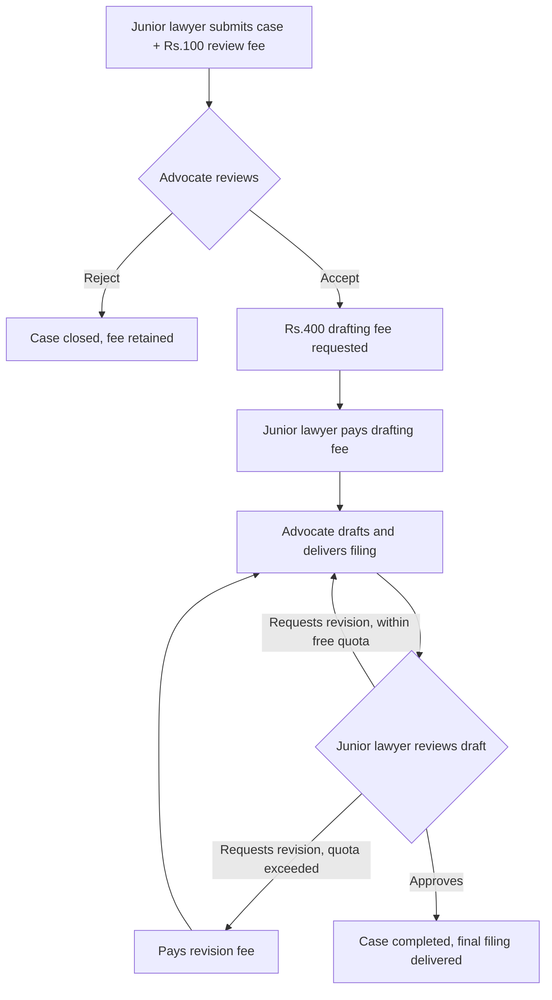

# Workflow

The business-facing view of the case-filing journey — see
`docs/low-level-design.md` §3 for the exact technical state machine this
implements.

## End-to-end flow

## Actors

- **Junior lawyer**: submits cases, pays fees, reviews drafts, requests
  revisions or approves.
- **Advocate (admin)**: reviews submissions, accepts/rejects, drafts and
  delivers filings.

## Step-by-step, with the policy decisions made explicit

1. **Submission** — junior lawyer uploads the case PDF and pays a ₹100
   review fee. The fee is charged *before* the advocate opens the document,
   and is **non-refundable on rejection** — the advocate did the work of
   reading it either way. This policy should be stated explicitly to junior
   lawyers at submission time (a UI/ToS concern, not just a backend one).
2. **Review** — the advocate reads the submitted PDF and decides accept or
   reject. There's currently no enforced SLA; a case can sit in
   `review_fee_paid` indefinitely. (Backlog: reminder job.)
3. **Rejection** — terminal. The junior lawyer is notified with a reason.
4. **Acceptance** — triggers the ₹400 drafting fee request. Nothing about the
   drafting stage starts until this second payment clears.
5. **Drafting** — the advocate prepares the filing and delivers it as a
   versioned document.
6. **Revision** — the junior lawyer can request changes. The first
   `FREE_REVISIONS` (default 1, configurable via env) requests are free;
   beyond that, a ₹150 (configurable) revision fee is charged before the
   advocate is notified of the next round. Each revision is tracked as its
   own `revision_requests` row, so there's a record of what was asked for
   and when it was resolved.
7. **Approval** — once satisfied, the junior lawyer approves and the case is
   marked complete. There is currently no separate "final signed copy" step
   distinct from the last draft — see backlog for the planned e-signature
   addition.

## Notifications sent at each step

| Event | Recipient | Trigger |
|---|---|---|
| Case rejected | Junior lawyer | `case_service.decide_case` |
| Case accepted | Junior lawyer | `case_service.decide_case` |
| Draft delivered | Junior lawyer | `case_service.deliver_draft` |
| Payment received | Junior lawyer | `payment_service.handle_payment_captured` |

All notifications are in-app rows today (`notifications` table); email/SMS
delivery is not yet wired up — see `docs/backlog.md`.
